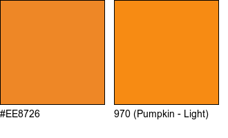
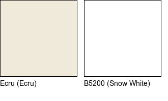

<!-- README.md is generated from README.Rmd. Please edit that file -->

# dmc

<!-- badges: start -->

[](https://travis-ci.org/sharlagelfand/dmc)
[](https://codecov.io/gh/sharlagelfand/dmc?branch=master)
[](https://www.tidyverse.org/lifecycle/#experimental)
<!-- badges: end -->

The goal of dmc is to allow you to find the closest DMC embroidery floss
colour(s) for a given colour, as well as access colour (hex, RGB)
information about DMC colours.

## Installation

You can install the development version of dmc from github with:

``` r
# install.packages(devtools)
devtools::install_github("sharlagelfand/dmc")
```

## Example

Say I’m interested in finding the closest DMC floss colour for the
background colour of the [`dplyr` package’s hex
logo](https://github.com/tidyverse/dplyr/blob/master/man/figures/logo.png)
😈.

I can look up the hex code for this colour via a site like [HTML Color
Codes](https://html-colour-codes.info/colours-from-image/). The hex code
is “\#EE8726”.

Then, I can use `dmc()` to find the closest DMC floss for this colour:

``` r
library(dmc)

dplyr_background <- "#EE8726"

dmc(dplyr_background)
#> # A tibble: 1 x 6
#>   dmc   name            hex       red green  blue
#>   <chr> <chr>           <chr>   <dbl> <dbl> <dbl>
#> 1 970   Pumpkin - Light #F78B13   247   139    19
```

<!-- -->

I can choose to show more than one matching colour:

``` r
dmc(dplyr_background, n = 3)
#> # A tibble: 3 x 6
#>   dmc   name                  hex       red green  blue
#>   <chr> <chr>                 <chr>   <dbl> <dbl> <dbl>
#> 1 970   Pumpkin - Light       #F78B13   247   139    19
#> 2 922   Copper - Light        #E27323   226   115    35
#> 3 721   Orange Spice - Medium #F27842   242   120    66
```

<!-- -->

And to turn off the visualization of the colours:

``` r
dmc(dplyr_background, visualize = FALSE)
#> # A tibble: 1 x 6
#>   dmc   name            hex       red green  blue
#>   <chr> <chr>           <chr>   <dbl> <dbl> <dbl>
#> 1 970   Pumpkin - Light #F78B13   247   139    19
```

By default, `dmc()` uses Euclidean distance to find the closest floss
colour. The method can be changed to be one of “euclidean”, “cie1976”,
“cie94”, “cie2000”, or “cmc”. For example:

``` r
dmc(dplyr_background, n = 3, method = "cie94")
#> # A tibble: 3 x 6
#>   dmc   name            hex       red green  blue
#>   <chr> <chr>           <chr>   <dbl> <dbl> <dbl>
#> 1 971   Pumpkin         #F67F00   246   127     0
#> 2 970   Pumpkin - Light #F78B13   247   139    19
#> 3 740   Tangerine       #FF8B00   255   139     0
```

<!-- -->

If I want to go the *other* way and just find the hex/RGB information
for a given DMC floss, I can use `undmc()`. By default, this visualizes
the DMC floss:

``` r
undmc("Ecru")
#> # A tibble: 1 x 6
#>   dmc   name  hex       red green  blue
#>   <chr> <chr> <chr>   <dbl> <dbl> <dbl>
#> 1 Ecru  Ecru  #F0EADA   240   234   218
```

<!-- -->

Again, the visualization can be turned off:

``` r
undmc(310, visualize = FALSE)
#> # A tibble: 1 x 6
#>   dmc   name  hex       red green  blue
#>   <chr> <chr> <chr>   <dbl> <dbl> <dbl>
#> 1 310   Black #000000     0     0     0
```

`undmc()` mostly just takes the DMC floss number, except in cases where
there isn’t one (e.g., Ecru).

A full list of floss colours in the package is available via `floss`:

``` r
floss
#> # A tibble: 454 x 6
#>    dmc   name                hex       red green  blue
#>    <chr> <chr>               <chr>   <dbl> <dbl> <dbl>
#>  1 3713  Salmon - Very Light #FFE2E2   255   226   226
#>  2 761   Salmon - Light      #FFC9C9   255   201   201
#>  3 760   Salmon              #F5ADAD   245   173   173
#>  4 3712  Salmon - Medium     #F18787   241   135   135
#>  5 3328  Salmon - Dark       #E36D6D   227   109   109
#>  6 347   Salmon - Very Dark  #BF2D2D   191    45    45
#>  7 353   Peach               #FED7CC   254   215   204
#>  8 352   Coral - Light       #FD9C97   253   156   151
#>  9 351   Coral               #E96A67   233   106   103
#> 10 350   Coral - Medium      #E04848   224    72    72
#> # … with 444 more rows
```

where the values in `floss[["dmc"]]` are all that can be passed to
`undmc()`.
